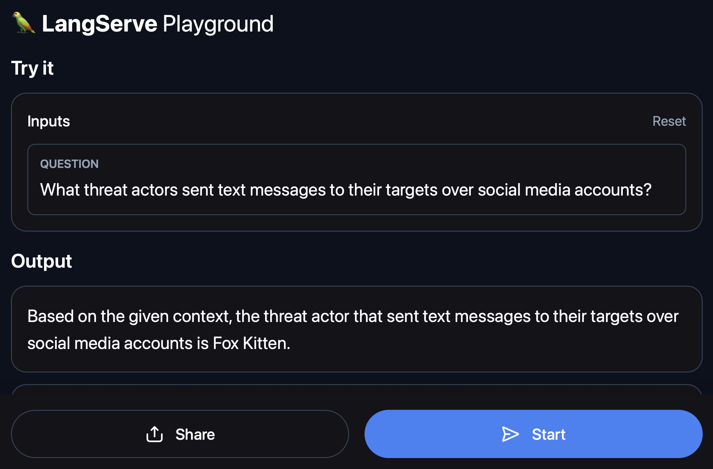

# Intel Retrieval Augmented Generation (RAG) Utilities

An open-source initiave to document and share experiments to apply Retrieval Augmented Generation (RAG) techniques to Threat Intelligence searching capabilities.

## Build Docker Image

```
docker build . -t rag-chroma
```

## Define .ENV File

Create a `.env` file and define the `OPENAI_API_KEY` variable with your OpenAI Key. This is needed to use the [LangChain's ChatOpenAI module](https://python.langchain.com/docs/integrations/chat/openai). This is not needed to embed the ATT&CK Groups data. This is done with the [all-mpnet-base-v2 sentence-transformers model](https://huggingface.co/sentence-transformers/all-mpnet-base-v2) ;) . 

```
OPENAI_API_KEY=XXXXXXXXX
```

## Run Docker Image

```
docker run -it --rm --name rag-chroma --env-file .env -p 8080:8080 rag-chroma
```

After running that command, the container will:
* Download the [all-mpnet-base-v2 sentence-transformers model](https://huggingface.co/sentence-transformers/all-mpnet-base-v2) (~400MB).
* Download the [Hugging Face Cyb3rWard0g/ATTCKGroups dataset](https://huggingface.co/datasets/Cyb3rWard0g/ATTCKGroups) (~846KB).
* Process the dataset by tokenizing and embedding every ATT&CK Group.
* Create the vector database by adding all the embeddings into a local [Chroma Database](https://www.trychroma.com).

## Explore Playground

Browse to `http://127.0.0.1/rag-chroma/playground` and start asking questions.



## References
* https://python.langchain.com/docs/templates/
* https://python.langchain.com/docs/templates/rag-chroma
* https://huggingface.co/datasets/Cyb3rWard0g/ATTCKGroups